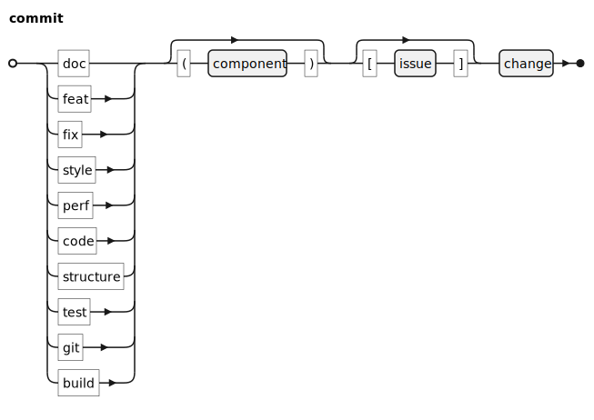
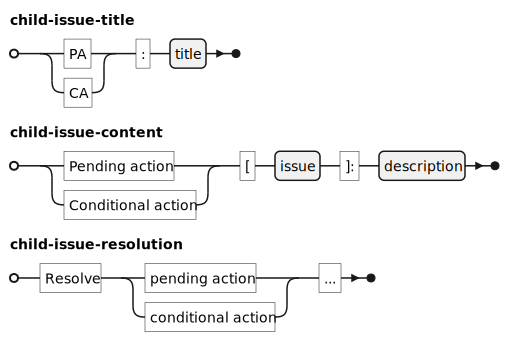

# Commits

## Writing Style

Write commit messages according to the following guidelines:

* Write in the present tense, the active voice, and the imperative mood.
* Always write concise, title-only commit messages.
* Never punctuate the end of titles.

## Prefixes

Prefix commit messages with one of the following labels.

|Label|Action|
|-|--------|
|doc: | Add, remove, or change documentation |
|feat:| Add or remove a feature|
|fix:| Fix a problem in code |
|style:| Improve code readability |
|perf:| Improve code performance |
|test: | Add, remove, or change test cases |
|git: | Deal with Git shenanigans |
|build: | Change build system, change external dependencies |

Optionally, suffix the label with the component that is changed.

Optionally, suffix the label with an issue ID.

[[1]](#references)

# Issues

## Writing Issues

Write issues that are concise, informative, and actionable:

**Concise** issues deal with one problem at a time. Such issues can be closed as soon as the one related problem is addressed.

**Informative** issues discuss the context and motivation.

**Actionable** issues provide information on how to solve the problem.

## Resolving Issues

### Comment

Start issue comments with one of the following types:

|Comment Type|Meaning|
|-|--------|
|Accept|Acceptance of an external issue|
|Reject|Rejection of an external issue|
|Resolve|Resolution of an internal issue|
|Comment|Comment does not resolve the issue|
	
Following the type, note actions after acceptance (or resolution) and reasons for rejection, according to the following syntax:

### Commits for Issues
In commits that address an issue, reference that issue.

In comments that close an issue, reference all commits that reference that issue.

### Child Issues
Modifiers `future action` and `pending change` create child issues. Write child issues in reference to the parent.

The workflow for spawning and closing child issues is as follows. Note to use `Resolve` and not `Accept`, since child issues are created by developers.

# References
[1] Developed in reference to [Contributing to Angular](https://github.com/angular/angular/blob/main/CONTRIBUTING.md)
