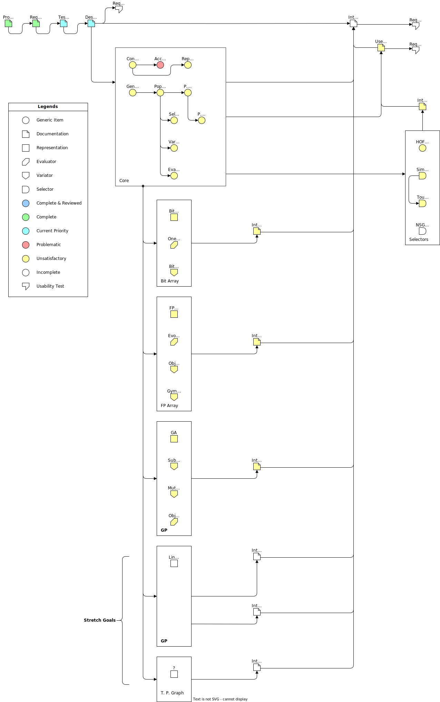

# Agolearn

**Developer**: Yiding Li

**Date of project start**: 2024-01-15

  
Table of Contents

  <ul>
    <li>
      <a href="#usage">Usage</a>
    </li>
    <li>
      <a href="#file-structure">File Structure</a>
    </li>
    <li>
      <a href="#roadmap">Roadmap</a>
    </li>
    <li>
      <a href="#commit-format">Commit Format</a>
    </li>
    <li>
      <a href="#licence">License</a>
    </li>
  </ul>

An evolutionary, derivative-free optimizer for real-valued and higher-order functions.

## Usage

## File Structure

The folders and files for this project are as follows:

* `docs/` - Documentation

* `refs/` - Reference material

* `src/` - Source code

* `test/` - Test cases

* `licenses/` - Licenses of components

* `media/` - Media files

## Roadmap

- [x] Add component licenses

- [x] [Problem statement](https://github.com/Tan630/Agolearn/blob/main/docs/ProblemStatementAndGoals/ProblemStatement.pdf)

- [x] [SRS](https://github.com/Tan630/Agolearn/blob/main/docs/SRS/SRS.pdf)

- [x] [VnV](https://github.com/Tan630/Agolearn/blob/main/docs/VnVPlan/VnVPlan.pdf)

- [x] [MG]([Agolearn/docs/Design/SoftArchitecture/MG.pdf at main · Tan630/Agolearn (github.com)](https://github.com/Tan630/Agolearn/blob/main/docs/Design/SoftArchitecture/MG.pdf))

- [x] [MIS](https://github.com/Tan630/Agolearn/blob/main/docs/Design/SoftDetailedDes/MIS.pdf)

- [x] [Code](https://github.com/Tan630/Agolearn/blob/main/src)

## Contributing
Please reference <a href="./CONTRIBUTING.md">CONTRIBUTING.md</a>

## Roadmap

### Licence
See `licenses/` for licenses for components of this project.

* `LICENCE-original`: Project template
* `LICENCE-logo`: Project logo uses Latin Modern Math